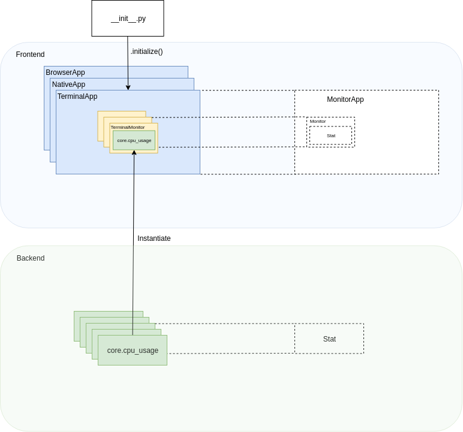

Contributor documentation
=========================

To contribute to Permon, first `find an issue <https://github.com/bminixhofer/permon/issues>`_ you would like to help solving. If you have suggestions for improvement or found a bug, please
`open a new issue <https://github.com/bminixhofer/permon/issues/new/choose>`_.
You are of course also welcome to just play around with Permon without the intent to tackle a specific issue.

Setup
-----

.. warning::
    This section assumes you are using commands from the linux shell. Bash scripts which might not work out of the box on windows are also used. See `this issue <https://github.com/bminixhofer/permon/issues/8>`_ for progress on
    cross-platform support during development.

First, make sure you have Python >= 3.6 and `Node.js and npm <https://www.npmjs.com/get-npm>`_ installed. Node.js and npm are needed for compiling Javascript and Sass for the browser frontend and the documentation.
Permon is tested on Node.js version 10.x but should work on other recent versions too.

Afterwards, clone the github repo.

``git clone https://github.com/bminixhofer/permon --branch=dev``

Now, ``cd`` into the directory and run ``pip install -r requirements.txt``. This will install the exact versions of all packages which Permon uses, including those only used during development. You might also want to create
some sort of `virtual environment <https://docs.python.org/3/tutorial/venv.html>`_ first.

Afterwards, run ``pip install -e .``. The ``-e`` flag tells PIP to install the module into the cloned directory instead of installing it into the directory for Python packages as it would normally do.
This way, Permon will directly run the code from the cloned directory so changes in the source code will immediately take effect.

Now, ``cd`` into the repo and run ``./bin/init.sh``. This will:

1. Install the Node modules needed for the documentation and browser frontend.
2. Register the hooks in ``.githooks`` as git hooks.

At the moment, ``.githooks`` only consists of a pre-commit hook which will lint your code and build the files in the javascript ecosystem.

Tools for use during development
--------------------------------

The ``bin`` directory contains a couple of useful scripts for use during development. When changing the Python code these are not needed.

When changing the parts of Permon which need a build they are very useful. In that case,
it is recommended to use a tool to watch your file system and rebuild on change for smooth development. I would recommend
`entr <http://eradman.com/entrproject/>`_. For example when writing docs, you can, assuming you are in the project root directory, run

``find permon/doc/ -not -path "permon/doc/node_modules/*" | entr ./bin/build-docs.sh``

Permon's structure
------------------

Permon is built in an object oriented way. Permon consists of one backend. The backend handles everything related to stats. It provides an abstract ``Stat`` class. Every stat inherits from this class.
The prepackaged stats are also part of the backend.

Permon also has a frontend. The frontend provides an abstract ``MonitorApp`` class. For every different application, a different ``MonitorApp`` must be implemented e. g. a ``TerminalApp``.

A ``MonitorApp`` consists of multiple ``Monitor`` instances. A monitor wraps a ``Stat`` with the capability of visually displaying it. The ``Monitor`` is also the only place where a ``Stat`` is instantiated.
This way, an instance exists always only of stats which are currently displayed. The ``MonitorApp`` can remove, add and change its monitors.

The choice of which app to instantiate is taken in ``permon/__init__.py``. The instantiation only sets some parameters on the app. The actual work is done, in the ``.initialize`` method of the app. If you want a quick overview of a frontend application, this is the
first function you should be looking at.

The likely easiest frontend app to get into is the terminal app. It consists of very few lines of code, all of which are contained in one file: ``permon/frontend/terminal.py``.